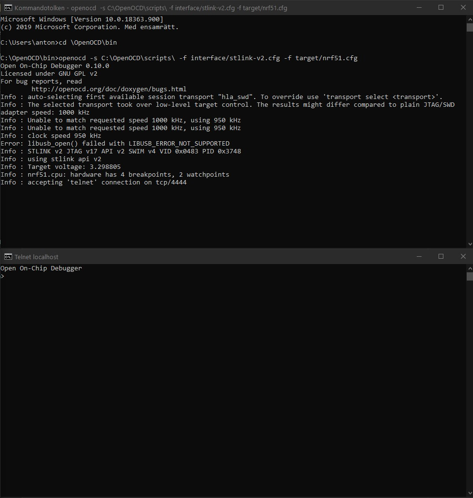
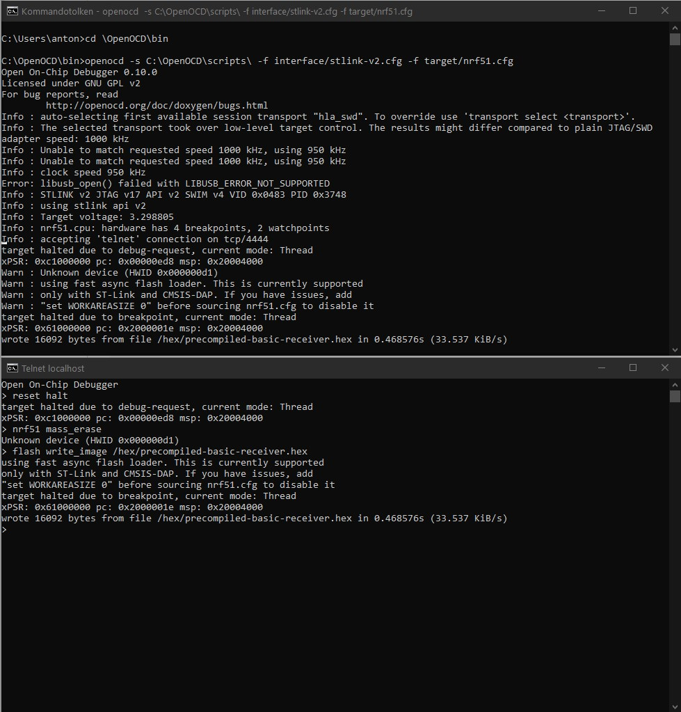
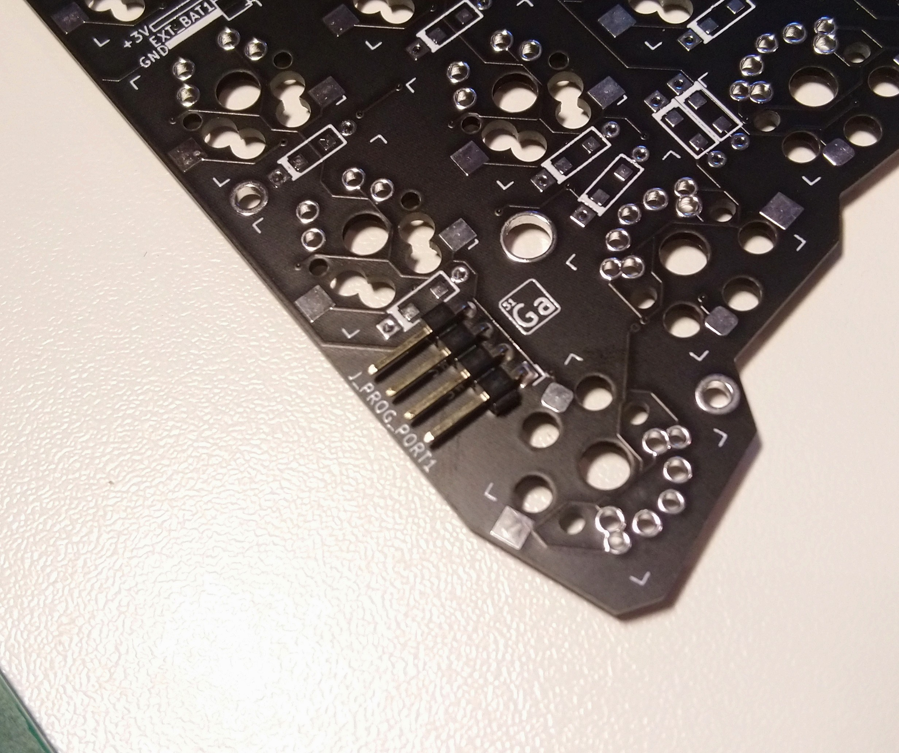

# Gallium Wireless Keyboard Firmware
Firmware for Nordic MCUs used in the Gallium wireless Keyboard, contains precompiled .hex files, as well as sources buildable with the Nordic SDK <br>
This firmware was derived from [Mattdibis' Redox-w](https://github.com/mattdibi/redox-w-firmware), [Reversebias' Mitosis](https://github.com/reversebias/mitosis) and [Durburz's Interphase](https://github.com/Durburz/interphase-firmware/) firmware.

## Gallium's documentation page
For additional information about the Gallium keyboard visit:
- [Gallium's Github page](https://github.com/slavfot/gallium-keyboard)

# Flashing firmware with Windows

## Setup the environment

1. Activate Telnet Client in windows:

- Open the Control Panel - with View By: Category.
- Click on Programs.
- Click on Turn Windows features on or off.
- Click on the checkbox next to Telnet client.
- Click OK.

2. Download pre-compiled openOCD
https://freddiechopin.info/en/download/category/4-openocd <br>
Unzip anywhere. 
But for ease of use in CMC i put it in C:\OpenOCD

## Flash with CMD

4. Connect st-link v2 to programming pins and plug in to USB.

5. Launch CMD.

6. With terminal commands position the CMD in 
```
\openOCD\bin
```
 - First make sure you are in the right drive.
If you need to change drive then type the drive letter only likes this "d:" <br>
after that you can navigate in that drive.
commands to navigate with:
cd (change directory)
cd .. (go back one directory)
dir (show all the directorys in the folder you are located in)

Tips: Press the tab button to automaticaly complete the directorys name while typing cd command.

7. Launch an openocd session with this command:
```
openocd -s C:\OpenOCD\scripts\ -f interface/stlink-v2.cfg -f target/nrf51.cfg
```

This line is written as if OpenOCD is located at C:\ <br>
Change accordingly to where you have it located.

8. Launch another CMD window.

9. cd to the location where the hex is located.

10. Run these commands in the new window, wait for each command to finish until you run the next command.
Connect to the OpenOCD session:
```
telnet localhost 4444
```
Should give you an output ending in:

```
Info : nrf51.cpu: hardware has 4 breakpoints, 2 watchpoints
```
Otherwise you likely have a loose or wrong wire.
s

From the factory, these chips need to be erased:
```
reset halt

nrf51 mass_erase
```
Write file to bt-module:
```
flash write_image /filepath/to/hexfile/precompiled-basic-receiver.hex
```
For keyboard halfs flash with either of these files:
```
flash write_image /filepath/to/hexfile/precompiled-basic-left.hex
```
or
```
flash write_image /filepath/to/hexfile/precompiled-basic-right.hex
```
(Example for the file path if the .hex file is located in C:/hexfiles :

flash write_image /hexfiles/precompiled-basic-receiver.hex )

This is how it should look when you connect with telnet:

<p align="center">

</p>

The whole process should look like this:

<p align="center">

</p>

11. End openOCD sessionen with ctrl+C in the first CMD window.

# Firmware Flashing on linux:

## Install dependencies

Tested on Ubuntu 16.04.2, but should be able to find alternatives on all distros.

```
sudo apt install openocd gcc-arm-none-eabi
```

## Download Nordic SDK

Nordic does not allow redistribution of their SDK or components, so download and extract from their site:

https://developer.nordicsemi.com/nRF5_SDK/nRF5_SDK_v11.x.x/nRF5_SDK_11.0.0_89a8197.zip

Firmware written and tested with version 11

```
unzip nRF5_SDK_11.0.0_89a8197.zip -d nRF5_SDK_11
cd nRF5_SDK_11
```

## Toolchain set-up

A cofiguration file that came with the SDK needs to be changed. Assuming you installed gcc-arm with apt, the compiler root path needs to be changed in /components/toolchain/gcc/Makefile.posix, the line:

```
GNU_INSTALL_ROOT := /usr/local/gcc-arm-none-eabi-4_9-2015q1
```

Replaced with:

```
GNU_INSTALL_ROOT := /usr/
```

## Clone repository
Inside nRF5_SDK_11/

```
git clone https://github.com/mattdibi/redox-w-firmware
```

## Install udev rules

```
sudo cp redox-w-firmware/49-stlinkv2.rules /etc/udev/rules.d/
```
Plug in, or replug in the programmer after this.

## OpenOCD server
The programming header on the side of the keyboard:

<p align="center">

</p>

It's best to remove the battery during long sessions of debugging, as charging non-rechargeable lithium batteries isn't recommended.

Launch a debugging session with:

```
openocd -s /usr/local/Cellar/open-ocd/0.8.0/share/openocd/scripts/ -f interface/stlink-v2.cfg -f target/nrf51_stlink.tcl
```
Should give you an output ending in:

```
Info : nrf51.cpu: hardware has 4 breakpoints, 2 watchpoints
```
Otherwise you likely have a loose or wrong wire.


## Manual programming
From the factory, these chips need to be erased:

```
echo reset halt | telnet localhost 4444
echo nrf51 mass_erase | telnet localhost 4444
```
From there, the precompiled binaries can be loaded:

```
echo reset halt | telnet localhost 4444
echo flash write_image `readlink -f precompiled-basic-left.hex` | telnet localhost 4444
echo reset | telnet localhost 4444
```

## Automatic make and programming scripts
To use the automatic build scripts:
* keyboard-left: `./redox-w-keyboard-basic/program_left.sh`
* keyboard-right: `./redox-w-keyboard-basic/program_right.sh`
* receiver: `./redox-w-receiver-basic/program.sh`

An openocd session should be running in another terminal, as this script sends commands to it.
